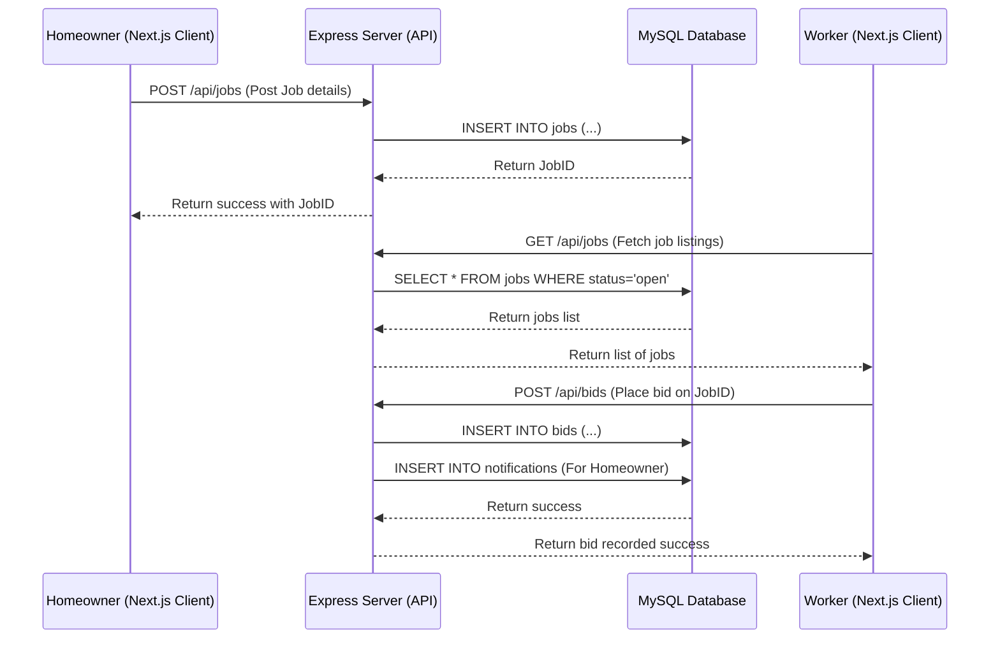

# 🏗️ System Architecture - Renovation Connect

This document outlines the architectural design, directory layout, technologies, and data flow of the Renovation Connect platform.

---

## 💻 Tech Stack Overview

- **Frontend**: Next.js (v15+) with React 19, TypeScript, Tailwind CSS, Lucide icons, and Radix UI primitives.
- **Backend**: Node.js, Express (v5+), CORS middleware, and Promise-based MySQL integration.
- **Database**: MySQL (v8.0) relational database.
- **Tooling**: Docker Compose for multi-container orchestration and custom PowerShell submission packagers.

---

## 🔄 High-Level Data Flow

The diagram below illustrates how a homeowner interacts with the system, posts a job, and how a worker receives notifications and places a bid:

---

## 🗂️ Key Directory Roles

### 1. `frontend/`
- **`app/`**: Implements Next.js App Router. Contains route directories for pages like `/about`, `/projects`, `/careers`, etc.
  - **`(auth)/`**: Handles Sign In and Sign Up route layouts.
  - **`(dashboard)/`**: Homeowner and Worker specific dashboard portals.
- **`components/`**: Modular page parts.
  - **`ui/`**: Reusable low-level widgets (buttons, dialogs, inputs) powered by Tailwind CSS.
  - **`landing/`**: Homepage-specific sections (Hero, How-It-Works, etc.).
  - **`dashboard/`**: User role-specific statistics widgets and lists.

### 2. `backend/`
- **`config/database.js`**: Reusable MySQL database connection pool using promises.
- **`routes/`**: Grouped endpoints for individual models:
  - `auth.js`: Registration & login validation.
  - `bids.js`: Placing, rejecting, or accepting worker proposals.
  - `messages.js`: Live messaging and notifications.
  - `payments.js`: Card & bank receipt submission and verification.
  - `reviews.js`: Worker rating score updates.
- **`server.js`**: Core entry point. Registers common middleware (CORS, body-parser) and mounts the route modules.

### 3. `database/`
- Centralizes table schemas and schema migration scripts. Running these scripts updates the database columns automatically without losing existing records.
